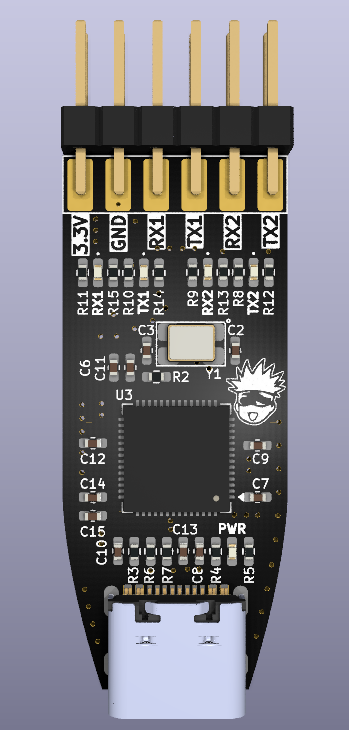
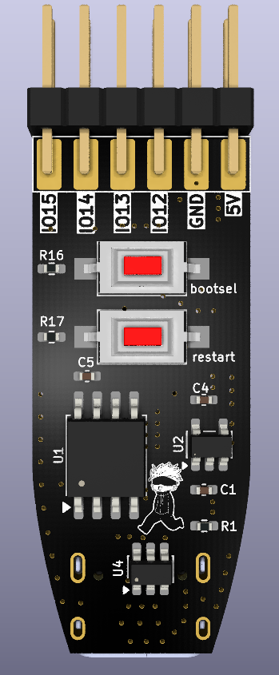

# Ryoiki

⚠️ **THIS PROJECT IS UNDER ACTIVE DEVELOPMENT AND TESTING
DO NOT MANUFACTURE OR USE THE HARDWARE WITHOUT YOUR OWN VERIFICATION**

---

## Images

### TOP



### BOTTOM



---

## Overview

**Ryoiki** is an RP2040-based multi-purpose USB protocol bridge designed for embedded development workflows where USB ports are limited and multiple hardware interfaces are required.

This project is inspired by:

* BlueTag
* Bus Pirate
* pico-uart-bridge

The device is designed to:

* Bridge multiple protocols (UART / I²C / SPI → USB)
* Reduce the number of USB ports used
* Act as a compact RP2040 header-style board with limited pins when needed

---

## Project Goal

During embedded Linux development, using multiple USB-to-serial converters quickly consumes all available USB ports and creates cable clutter.

**Ryoiki** solves this by providing multiple interfaces over a single USB connection in a compact and flexible form factor.

---

## Current Status

| Interface | Status                                 |
| --------- | -------------------------------------- |
| UART      | ✅ Working                              |
| I²C       | 🚧 In development (currently disabled) |
| SPI       | 🚧 In development (currently disabled) |

This is a prototype and both hardware and firmware are still under validation.

---

## Firmware

The current firmware is based on my fork of the pico-uart-bridge project.

When connected to a Linux system, the device enumerates as two independent CDC interfaces:

```text
/dev/ttyACM0  
/dev/ttyACM1
```

Each interface provides access to one UART channel.

### Features

* Auto-baudrate detection
* No manual baudrate configuration required
* Plug-and-play on Linux

---

## Hardware Design

The hardware is designed based on:

* RP2040 Zero form factor
* Official Raspberry Pi RP2040 hardware design guidelines

### Design Targets

* Compact size
* Low component count
* High flexibility for future features
* Header-style usability in external projects

### Hardware Features

* RP2040 microcontroller
* USB device interface
* Dual UART ports
* Dedicated **RX/TX status LEDs** for each UART

Designed with **KiCad**.

---

## Use Cases

* Embedded Linux development
* Multi-device serial debugging
* Compact USB lab tool
* Future multi-protocol debugging interface

---

## Future Plans

| Feature                   | Description                                   | Status            |
| ------------------------- | --------------------------------------------- | ----------------- |
| I²C Bridge                | USB to I²C interface                          | 🚧 In development |
| SPI Bridge                | USB to SPI interface                          | 🚧 In development |
| Multi-protocol Debug Mode | Bus Pirate / BlueTag-like functionality       | 🧩 Planned        |

---

## Development Notes

* Hardware revisions are expected
* Firmware is evolving rapidly
* Not production-ready

---

## Repository Structure

```text
/hardware   → KiCad design files  
/firmware   → RP2040 firmware  
/docs       → Documentation  
```
